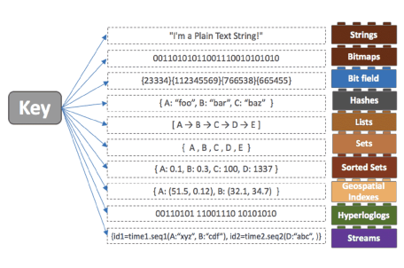

# 📚 Redis

---
### [NoSQL_ 설명](https://github.com/HwangHarim/TDL/blob/main/.idea/ToDayLearn/ToDayTopic/Database/NoSQL.md)

## Redis 이란?

- In-Memory 기반의 Data Structure Store 이다.
- 주로 캐시 용도로 많이 사용된다.
- 인메모리 기반이기 때문에 서버가 재시작하면 휘발된다.
- Redis Persistence를 통한 일정 주기마다 데이터를 디스크에 스냅 샷 형태로 백업하는 용도로 사용

## Redis의 장점

- 리스트 배열과 같은 데이터를 처리하는데 유용하다.
  - value 값으로 문자열, 리스트 set,sorted,set,hash 등 여러 데이터 형식을 지원
  - 따라서 다양한 방식으로 데이터를 활용할 수 있다.
  -  리스트형 데이터 입력과 삭제가 MySQL에 비해서 10배저도 빠르다고 한다.

- 메모리를 활용하면서 영속적인 데이터 보존
  - 명령어로 명시적으로 삭제, expires를 설정하지 않으면 데이터가 삭제되지 않는다.

- Redis Server는 1개의 싱글 쓰레드로 수행되며, 따라서 서버 하나에 여러개의 서버를 띄우는 것이 가능
  - Single Thread로 동작하기 때문에 동시에 처리할 수 있는 명령어는 하나이다.
  - Master - Slave 형식으로 구성이 가능하다.
  - 데이터 분실 위험을 없애주는 것이 바로 위의 Master-Slave 방식이다.

## Redis에서 사용하는 자료 구조
| 데이터 구조     | 설명                                                                                       |
|------------|------------------------------------------------------------------------------------------|
| String     | key-value 로 저장하는 형태                                                                      |
| List       | Array 형식의 데이터 구조로 List를 사용하면 처음과 끝에 데이터를 넣고 빼는 것은 속도가 빠르지만 중간에 데이터를 삽입할 때는 어렵다.          |
| Set        | 순서가 없는 string 데이터 집합으로 Set 에서는 중복된 데이터는 하나로 처리하기 때문에, 중복에 문제가 없다.                        |
| Sorted Set | Sets와 같은 구조이지만 Score를 통해 순서를 정할 수 있다. Sorted Sets를 사용하면 Leaderboard와 같은 기능을 쉽게 구현할 수 있다. |
|   Hashes   | Key-Value 구조를 여러개 가진 object 타입을 저장하기 좋은 구조이다.                                            |



## Spring boot 에 적용하기


***build.gradle***
```groovy
implementation 'org.springframework.boot:spring-boot-starter-data-redis'
```

***RedisConfig.java***
```java
@RequiredArgsConstructor
@Configuration
@EnableRedisRepositories
public class RedisConfig {
    
    @Value("${spring.data.redis.host}")
    private String host;
    
    @Value("${spring.data.redis.port}")
    private int port;

    @Bean
    public RedisConnectionFactory redisConnectionFactory(){
        return new LettuceConnectionFactory(host, port);
    }
    
    @Bean
    public RedisTemplate<String, Object> redisTemplate(){
        RedisTemplate<String, Object> redisTemplate =  new RedisTemplate<>();
        redisTemplate.setConnectionFactory(redisConnectionFactory());
        redisTemplate.setKeySerializer(new StringRedisSerializer());
        redisTemplate.setValueSerializer(new StringRedisSerializer());
        return redisTemplate;
    }
}

/**
 * RedisConnectionFactory 인터페이스를 통해 LettuceConnectionFactory 를 생성하여 반환
 * setKeySerializer과 SetValueSerializer을 사용한 이유는 Spring - Redis간 데이터 직렬화, 역직렬화 시 사용하는 방식이 
 * jdk직렬화 방식하여 동작에는 문제없지만 Redis-cli을 통해 직접 데이터를 보려고 할 때 알아볼수 없는 형태로 출력되기 때문에 적용한 설정이다.
 */
```

***Member.java***
```java

package com.study.core.entity;

import lombok.Getter;
import lombok.Setter;
import org.springframework.data.annotation.Id;
import org.springframework.data.redis.core.RedisHash;

//value -> RedisHash 테이블의 이름
//timeToLive -> 데이터가 유기되는 시간
//@Id -> 기본키를 담당 기본 String 랜덤으로 자동 설정됨

@Getter
@Setter
@RedisHash(value ="member", timeToLive = 40)
public class Member {
    @Id
    private String id;
    private String name;
    private int age;

    public Member(String name, int age) {
        this.name = name;
        this.age = age;
    }
}

```

---

## ⛓️참고자료

---

- https://velog.io/@rlaghwns1995/Redis-%EA%B8%B0%EB%B3%B8%EC%A0%95%EB%A6%AC
- https://bcp0109.tistory.com/328
- https://wildeveloperetrain.tistory.com/32